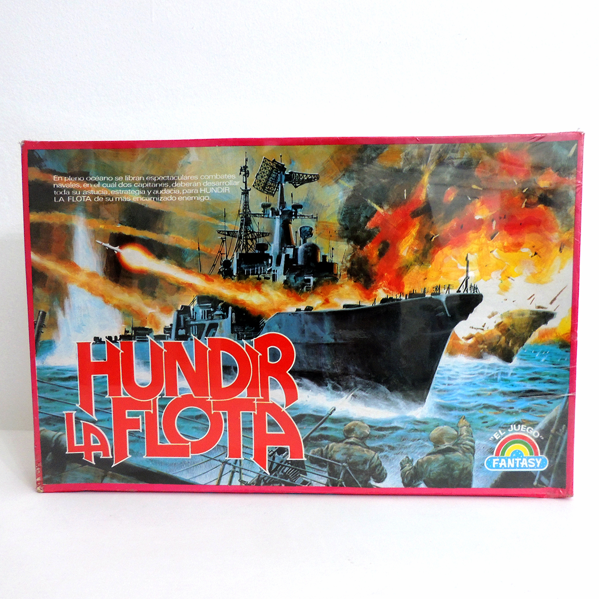

# **JUEGO DE HUNDIR LA FLOTA**

##  <u> *Instrucciones*</u>

Cada jugador tiene dos tableros de dimensiones de 10x10, uno para colocar sus barcos y otro para señalar donde ha disparado. Los jugadores tienen que colocar 4 barcos de diferentes tamaños: un portaaviones (5 casillas), un acorazado (4 casillas), un submarino (3 casillas) y un destructor (2 casillas).

1. ***Colocación de los barcos:*** Cada jugador debe colocar sus barcos en secreto en su tablero. Los barcos sólo pueden colocarse en horizontal o vertical, pero no en diagonal. Tampoco pueden solaparse entre sí.
El jugador será quien primero cree sus barcos y los coloque en su tablero. Las entradas de coordenadas de los barcos cuando se crean deben tener el siguiente formato: *número,número*
Seguidamente, el ordenador creará sus barcos de forma aleatoria y los posicionará en su tablero.
2. ***Turnos:*** Los jugadores se turnan para disparar la flota enemiga, anunciando una coordenada en el tablero del oponente. Si el disparo impacta en un barco enemigo, el oponente debe anunciar "¡Tocado!" y el atacante marca la casilla como "X". Si por el contrario, el disparo cae en el agua, el oponente anuncia "¡Agua!", y el atacante marca esa casilla como una "a".
3. ***Ganar:*** El jugador que logre destruir toda la flota enemiga, no le queden más "O", gana la partida.
